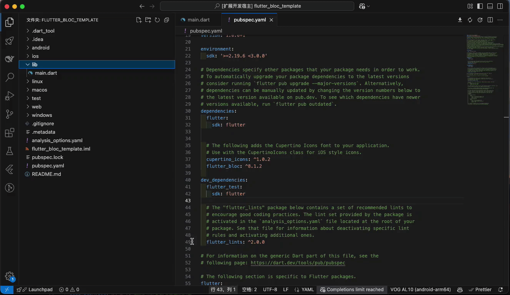

# Flutter Bloc - New Bloc Template

**Flutter Bloc is a Visual Studio Code extension designed to simplify the creation of Bloc/Cubit structure files in Flutter applications. With this extension, developers can generate well-structured Bloc/Cubit files and predefined templates with just a few clicks.

---


## Features

- **Generate Bloc/Cubit Template Files**  
  Quickly generate the following files needed for Flutter Bloc/Cubit patterns:
  - Bloc Pattern Files:
    - `class_name_bloc.dart`
    - `class_name_event.dart`
    - `class_name_state.dart`
  - Cubit Pattern Files:
    - `class_name_cubit.dart`
    - `class_name_state.dart`

- **Automated Folder and File Naming**  
  The extension creates new folders based on your input class name, formats folder and file names following the `snake_case` naming convention, and ensures Dart class names follow the `PascalCase` naming convention.

- **Right-Click Menu Shortcut**  
  Simply right-click on a folder in the file explorer, select the command, input the desired class name, and the extension will handle the rest automatically.

---

## Usage

1. Install the extension in Visual Studio Code.
2. Open VS Code's file explorer.
3. Right-click on the folder where you want to create Bloc/Cubit files.
4. Select the **Flutter Bloc: New Bloc Template** option from the context menu.
5. Choose either "Bloc" or "Cubit" mode when prompted.
6. Enter a class name (e.g., `CreateName`) when prompted.
7. Choose whether to create a new folder for the files.
8. The extension will:
   - Create a new folder named `create_name` (if selected).
   - Generate template files based on the selected mode.

---

## Generated Code Examples

### Bloc Pattern Example

When you choose the Bloc pattern and enter a class name (e.g., `Counter`), the following files will be generated:

#### counter_bloc.dart
```dart
import 'package:bloc/bloc.dart';

import 'counter_event.dart';
import 'counter_state.dart';

class CounterBloc extends Bloc<CounterEvent, CounterState> {
  CounterBloc() : super(CounterState()) {
    on<InitEvent>(_init);
  }

  void _init(InitEvent event, Emitter<CounterState> emit) async {
    emit(state.clone());
  }
}
```

#### counter_event.dart
```dart
abstract class CounterEvent {}

class InitEvent extends CounterEvent {}
```

#### counter_state.dart
```dart
class CounterState {
  CounterState clone() {
    return CounterState();
  }
}
```

### Cubit Pattern Example

When you choose the Cubit pattern and enter a class name (e.g., `Theme`), the following files will be generated:

#### theme_cubit.dart
```dart
import 'package:bloc/bloc.dart';

import 'theme_state.dart';

class ThemeCubit extends Cubit<ThemeState> {
  ThemeCubit() : super(ThemeState());
}
```

#### theme_state.dart
```dart
class ThemeState {
  ThemeState clone() {
    return ThemeState();
  }
}
```

---

## Known Issues

- The command only works when right-clicking on a folder in the file explorer.
- Please ensure class names follow Dart naming conventions.

---

## License

This project is licensed under the MIT License - see the LICENSE.md file for details.

---

## Feedback and Contributions

If you encounter any issues or have suggestions for improvements, feel free to raise an issue or submit a pull request in the project's GitHub repository.

---

## Changelog
### [0.0.3] - 2025-03-10
#### Added

- Added Cubit pattern code generation

### [0.0.2] - 2024-12-23
#### Added

- Added folder creation option, allowing users to choose whether to create a new folder for generated files

#### Improvements
- Enhanced error message notifications
- Optimized file naming conventions

### [0.0.1] - 2024-12-23
#### Initial Release

- Support for Bloc pattern code generation
- Quick creation of Bloc files through context menu
- Automatic generation of bloc, event, and state files
- Adherence to snake_case and PascalCase naming conventions
